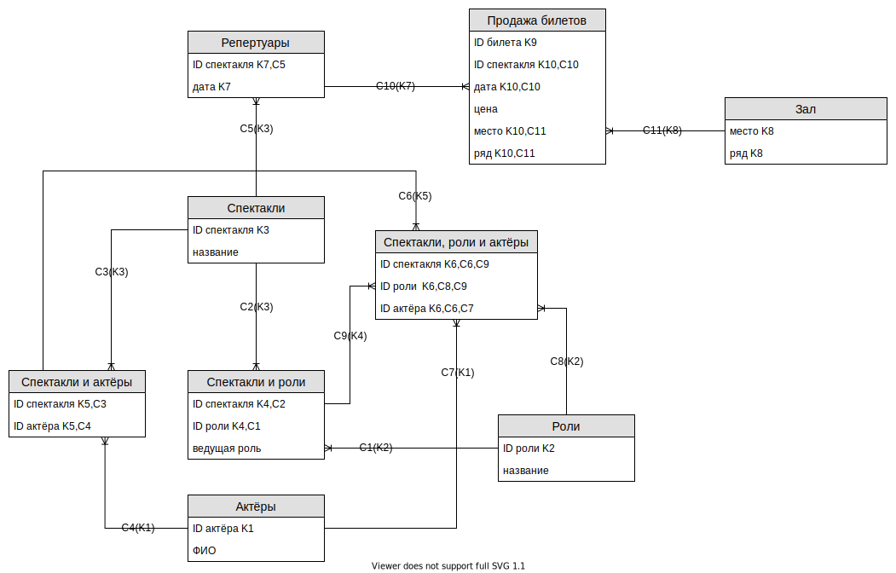

# BACHELOR COURSEWORK: REMASTERED. PART 1: BACK-END.

## Некоторые определения из мира театрального искусства:

1. Спектакль - театральное зрелище, представление, воспроизводимое в определённый момент времени на сцене. Создаётся на основе драматического или музыкально-сценического произведения в соответствии с замыслом режиссера совместными усилиями актёров, художника и др.
2. Репертуар - набор спектаклей для показа на сцене театра в некоторый промежуток времени.

## ER-model

### Ключи:

* К1: «Актёры» (ID актёра)
* К2: «Роли» (ID роли)
* К3: «Спектакли» (ID спектакля)
* К4: «Спектакли и роли» (ID спектакля, ID роли)
* К5: «Спектакли и актёры» (ID спектакля, ID актёра)
* К6: «Спектакли, роли и актёры» (ID спектакля, ID роли, ID актёра)
* К7: «Репертуары» (ID спектакля, дата)
* К8: «Зал» (место, ряд)
* К9: «Продажа билетов» (ID билета)
* К10: «Продажа билетов» (ID спектакля, дата, место, ряд)

### Связи:

* C1 [1-N]: «Спектакли и роли» (ID роли) → «Роли».К2 (ID роли)
* C2 [1-N]: «Спектакли и роли» (ID спектакля) → «Спектакли».К3 (ID спектакля)
* C3 [1-N]: «Спектакли и актёры» (ID спектакля) → «Спектакли».К3 (ID спектакля)
* C4 [1-N]: «Спектакли и актёры» (ID актёра) → «Актёры».К1 (ID актёра)
* C5 [1-N]: «Репертуары» (ID спектакля) → «Спектакли».К3 (ID спектакля)
* C6 [1-N]: «Спектакли, роли и актёры» (ID спектакля, ID актёра) → «Спектакли и актёры».К5 (ID спектакля, ID актёра)
* C7 [1-N]: «Спектакли, роли и актёры» (ID актёра) → «Актёры».К1 (ID актёра)
* C8 [1-N]: «Спектакли, роли и актёры» (ID роли) → «Роли».К2 (ID роли)
* C9 [1-N]: «Спектакли, роли и актёры» (ID спектакля, ID роли) → «Спектакли и роли».К4 (ID спектакля, ID роли)
* C10 [1-N]: «Продажа билетов» (ID спектакля, дата) → «Репертуары».К7 (ID спектакля, дата)
* C11 [1-N]: «Продажа билетов» (место, ряд) → «Зал».К8 (место, ряд)